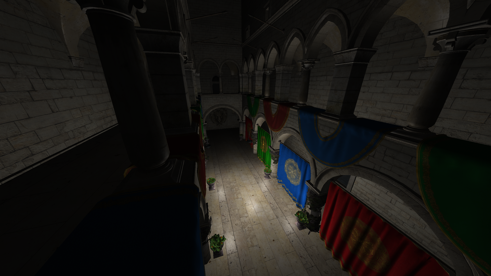

# HEN SDK

 
 

 

HEN SDK is a small WIP SDK for 3D games. It is currently a learning project so it is recommended that you don't use this for a full-feature game or for any game really.

### Supported Platforms

* Windows
* Debian based Linux distros

## Showcase

## Building

### Prerequisiteries

It is recommended that you have [VSCode](https://code.visualstudio.com/).  
You will need a compiler for your platform:

| Platform | Compiler | Link |
| ------------- | ------------- | ------------- |
| Windows | MSVC | [Visual Studio](https://visualstudio.microsoft.com/downloads/?q=build+tools#build-tools-for-visual-studio-2022) | 
| Linux | Clang | [Clang](https://releases.llvm.org/download.html) | 

 

You will also need the following:
* [CMake](https://github.com/Kitware/CMake)  
* [Git](https://git-scm.com/downloads)
* Linux development libraries (if you're on linux)

### Configuring and Compiling

WIP
