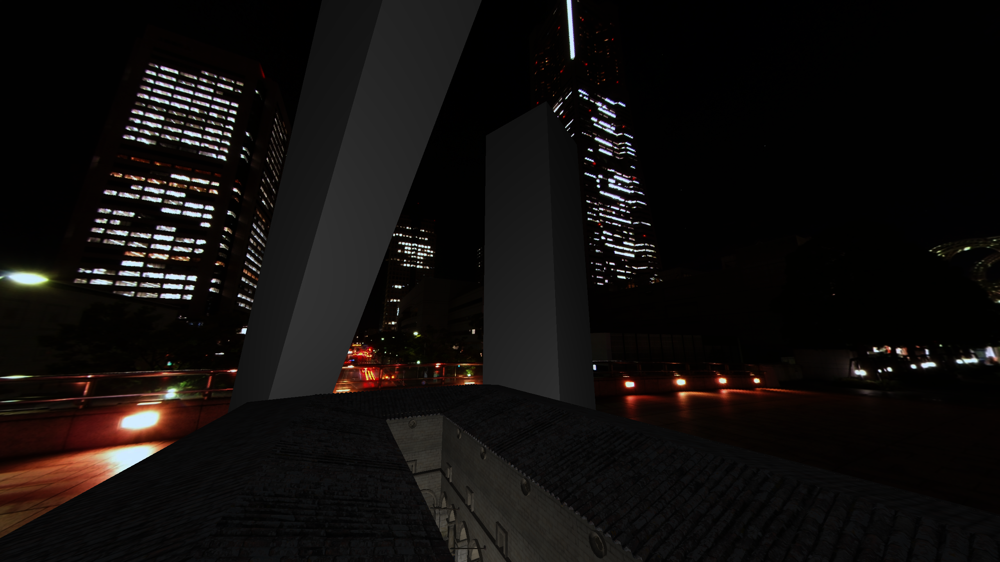

# HEN SDK

 

 

 

 

HEN SDK is a small WIP SDK for 3D real time applications. It is currently a learning project so it is recommended that you don't use this for a full-feature game or for any game at all.

## Features

### Systems

* [Entity Component System](HENEngine\include\level\henLevel.h)
  * [Components](HENEngine/include/level/henLevel_Components.h)
* [Physics](HENEngine\include\physics\henPhysics.h)
* [Job System](HENEngine\include\core\henJobSystem.h)
* [Console System](HENEngine\include\tools\henConsole.h)
  * [Console Variable System](HENEngine\include\core\henCVar.h)
* [Forward Renderer](HENEngine\include\renderer\henRenderer.h)
  * [Graphics Objects](HENEngine\include\graphics\henGraphics.h) 
    * [OpenGL Backend](HENEngine\src\graphics\henGraphics_OpenGL.h)
  * [Render Hardware Context](HENEngine\include\renderer\henRHC.h)
    * [OpenGL Backend](HENEngine\src\renderer\henRHC_OpenGL.h)

### Graphics
* 3D skybox <i> inspired by Source Engine</i>
* 2D skybox 
* Blinn-phong lighting
* Diffuse and specular lighting workflow

## Showcase

## Building

### Supported Platforms

* Windows
* Debian based Linux distros

### Prerequisiteries

It is recommended that you have [VSCode](https://code.visualstudio.com/).  
You will need a compiler for your platform:

| Platform | Compiler | Link |
| ------------- | ------------- | ------------- |
| Windows | MSVC | [Visual Studio](https://visualstudio.microsoft.com/downloads/?q=build+tools#build-tools-for-visual-studio-2022) | 
| Linux | Clang | [Clang](https://releases.llvm.org/download.html) | 

 

You will also need the following:
* [CMake](https://github.com/Kitware/CMake)  
* [Git](https://git-scm.com/downloads)
* Linux development libraries

### Configuring and Compiling

WIP
