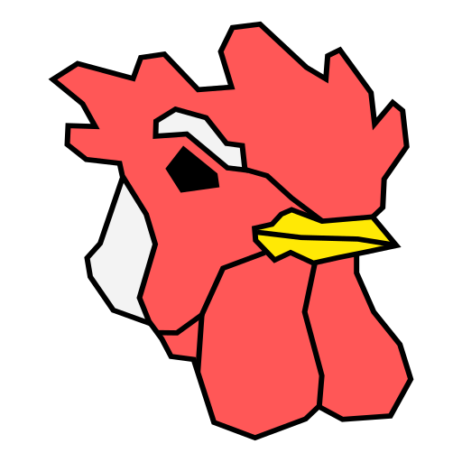

# HEN SDK

 
 

HEN SDK is a small WIP SDK for 3D games. It is currently a learning project so it is recommended that you don't use this for a full-feature game.

## Getting started

The easiest way to get started is to install [VSCode](https://code.visualstudio.com/). After that you will need a C++ compiler for your platform:
| Platform | Compiler | Instructions |
| ------------- | ------------- | ------------- |
| Windows | msvc | [Build tools for Visual Studio](https://visualstudio.microsoft.com/downloads/?q=build+tools#build-tools-for-visual-studio-2022) | 

After that you should be able to clone the repository and open it up in VSCode. From VSCode, you can select the configure preset, configure and build.